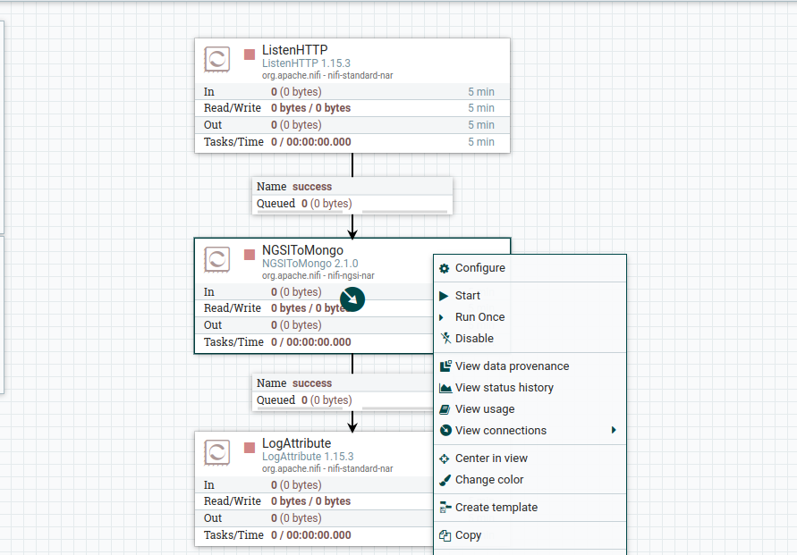
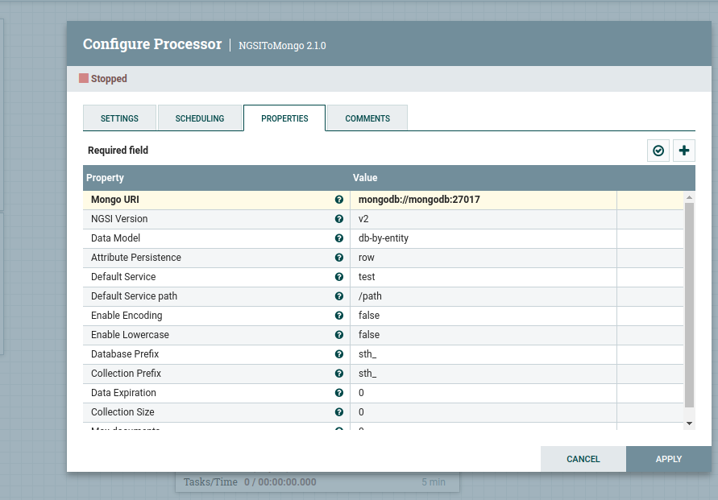

# fiware-project

Integração dos dados da estação metereológica Envcity com o ambiente Fiware

## Teconlogias usadas
- IotAgentLoraWAN (Intermédio para obetr dados dos dispositivos da estação Envcity)
- Orion Context Broker (Receber dados dos dispositos)
- MongoDB (Armazenar/atualizardados dados das entidades do Orion)
- Draco (Sistema para gerenciamento do DataFlow/ Usado para persistir os dados)

Pré-requisitos: 
 - Docker Compose version v2.20.3 ou acima
 - Docker version 24.0.7, build 24.0.7-0ubuntu ou acima


## Execução

- Baixe o projeto localmente
```console
git clone https://github.com/pedromujica1/fiware-envcity.git
```
- Inicie os containers
```
cd fiware-envcity
docker-compose -f docker/docker-compose.yml up -d
```
- Verifique se os container estão em execução pelo seguinte comando
```
docker ps
```

#### 1️⃣ Requisição para verificar estado do draco:

```console
curl -X GET \
  'http://localhost:9090/nifi-api/system-diagnostics'
```

#### Resultado deve ser algo parecido

```json
{
    "systemDiagnostics": {
        "aggregateSnapshot": {
            "totalNonHeap": "185.66 MB",
            "totalNonHeapBytes": 194682880,
            "usedNonHeap": "175.44 MB",
            "usedNonHeapBytes": 183967304,
            "freeNonHeap": "10.22 MB",
            "freeNonHeapBytes": 10715576,
            "maxNonHeap": "-1 bytes",
            "maxNonHeapBytes": -1,
            "totalHeap": "477 MB",
            "totalHeapBytes": 500170752,
            "usedHeap": "183.07 MB",
            "usedHeapBytes": 191966680,
            "freeHeap": "293.93 MB",
            "freeHeapBytes": 308204072,
            "maxHeap": "477 MB",
            "maxHeapBytes": 500170752,
            "heapUtilization": "38.0%",
            "availableProcessors": 4,
            "processorLoadAverage": 0.24,
            "totalThreads": 65,
            "daemonThreads": 26,
            "uptime": "00:48:56.788",
        ....
```

Em seguida, abra o seu navegador e acesse o Draco usando o seguinte URL: http://localhost:9090/nifi.

Agora, vá para a barra de ferramentas Components (Componentes), localizada na parte superior da interface gráfica do NiFi (GUI). Encontre o ícone de template (Sétimo icone ao lado direito do logo NIFI), arraste-o e solte-o dentro do espaço de trabalho do Draco. Nesse momento, uma janela pop-up deve ser exibida com uma lista de todos os modelos disponíveis. Por favor, selecione o modelo chamado MONGO-TUTORIAL.


Após selecionar o template, selcione a caixa NGSIToMongo e clique com o botão direito e depois selcione a opção configure


A configuração deve ficar desta forma com essa URI: mongodb://mongodb:27017


